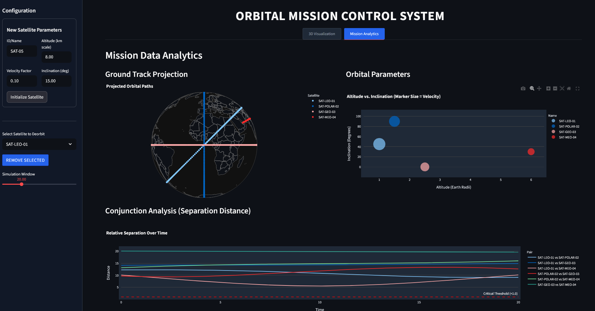

# ORBITAL MISSION CONTROL SYSTEM: TECHNICAL DOCUMENTATION

**Author:** Rajvardhan Chhugani  
**Contact:** chhuganirajvardhan@gmail.com  

---

## 1. ABSTRACT

The Orbital Mission Control System is a Python-based simulation environment designed to visualize and analyze satellite trajectories in a three-dimensional Earth-centered inertial frame. This software suite provides a dual-interface approach: a web-based interactive mission control dashboard utilizing Streamlit and a standalone high-fidelity rendering engine powered by Plotly. The system allows for the dynamic configuration of orbital parameters (altitude, velocity, inclination), real-time propagation of satellite ephemerides, and conjunction assessment to identify potential collision risks.

## 2. SYSTEM ARCHITECTURE

The software is modularized into three core components to ensure separation of concerns between physical computations, user interface, and data visualization.

### 2.1. Physics Engine (`orbit.py`)
The backend logic is encapsulated in the `Satellite` class, which computes orbital state vectors based on Keplerian elements.
* **Trajectory Calculation:** Computes Cartesian coordinates (x, y, z) based on orbital radius, angular velocity, and inclination.
* **Coordinate Transformation:** Handles the rotation of orbital planes relative to the equatorial plane using rotation matrices.
* **Conjunction Assessment:** Includes algorithms to calculate Euclidean distances between satellite pairs to detect close approach events.

### 2.2. Mission Control Interface (`app.py`)
This module serves as the primary user interface, built with the Streamlit framework. It facilitates:
* **Dynamic Injection:** Users can input orbital parameters to launch new satellites into the simulation in real-time.
* **Telemetry Dashboard:** Displays active satellite configurations and simulation controls.
* **Analytics Suite:** Visualizes ground track projections (latitude/longitude) and correlates orbital regimes (LEO, MEO, GEO) via scatter plots.

### 2.3. Standalone Visualizer (`visualizer.py`)
A dedicated script for generating high-resolution, cinematic renders of the orbital environment. It operates independently of the web interface to provide smooth animation playback and detailed inspection of orbital paths against a starfield background.

## 3. INSTALLATION AND EXECUTION

### 3.1. Prerequisites
The system requires a Python environment (version 3.8 or higher) with the following dependencies installed:
* numpy
* matplotlib
* streamlit
* plotly
* pandas

### 3.2. Setup Instructions
1.  **Clone the Repository:** Ensure all source files (`app.py`, `orbit.py`, `visualizer.py`) and the `assets` folder are present in the root directory.
2.  **Install Dependencies:** Execute the following command in the terminal:
    ```bash
    pip install -r requirements.txt
    ```

### 3.3. Execution
* **To launch the Mission Control Dashboard:**
    ```bash
    streamlit run app.py
    ```
* **To run the Standalone Visualizer:**
    ```bash
    python visualizer.py
    ```

## 4. SYSTEM FEATURES AND ANALYTICS

### 4.1. 3D Orbital Visualization
The system renders an interactive 3D globe with atmospheric mapping. Satellites are depicted with historical trail markers to visualize orbital planes. The visualization engine supports pan, zoom, and rotation interactions.


*Figure 1: 3D visualization of satellite constellations orbiting Earth.*

### 4.2. Mission Analytics
The analytics module processes telemetry data to generate actionable insights.
* **Ground Track Projection:** Maps the sub-satellite point onto a 2D orthographic projection of Earth.
* **Regime Classification:** Categorizes satellites based on altitude and inclination relationships.


*Figure 2: Ground track projections and orbital parameter correlation plots.*

### 4.3. Visualizer Interface
The standalone visualizer provides a focused view of the orbital mechanics without the overhead of the web UI, optimized for trajectory verification.


*Figure 3: High-fidelity rendering of orbital paths in the standalone visualizer.*

## 5. CODE REFERENCE

The core orbital propagation logic is defined as follows (excerpt from `orbit.py`):

```python
def position(self, t):
    # Calculate angle in the orbital plane
    theta = self.w * t + self.phase
    
    # 1. Position in a flat 2D plane (un-tilted)
    x_flat = self.r * np.cos(theta)
    y_flat = self.r * np.sin(theta)
    
    # 2. Rotate the plane by the inclination angle (around the X-axis)
    x = x_flat
    y = y_flat * np.cos(self.inc)
    z = y_flat * np.sin(self.inc)
    
    return np.array([x, y, z])
```
## 6. CONCLUSION

The Orbital Mission Control System demonstrates a robust application of numerical methods to simulate astrodynamics. By integrating physics-based modeling with modern visualization libraries, the tool provides a viable platform for mission planning and educational demonstration of Keplerian mechanics.