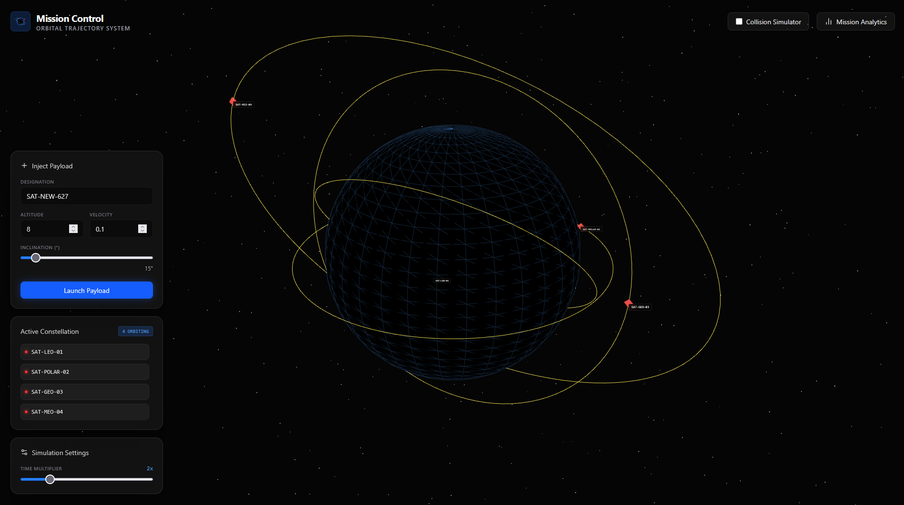
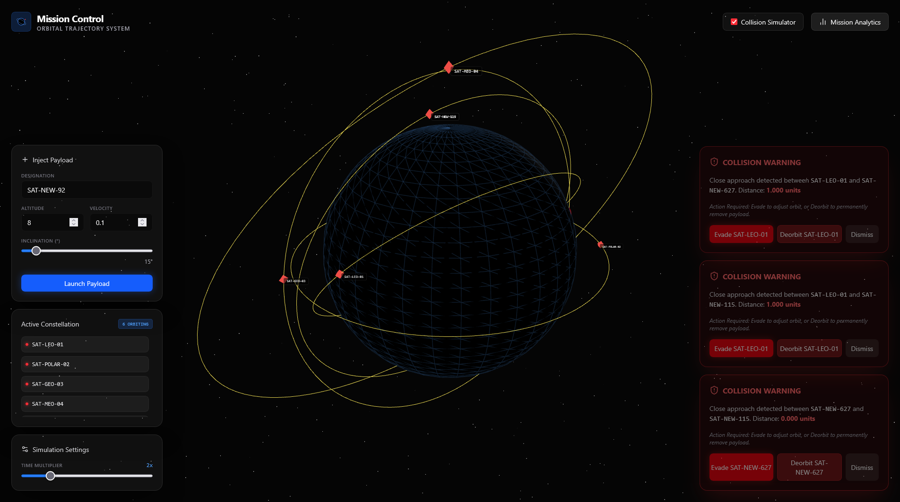
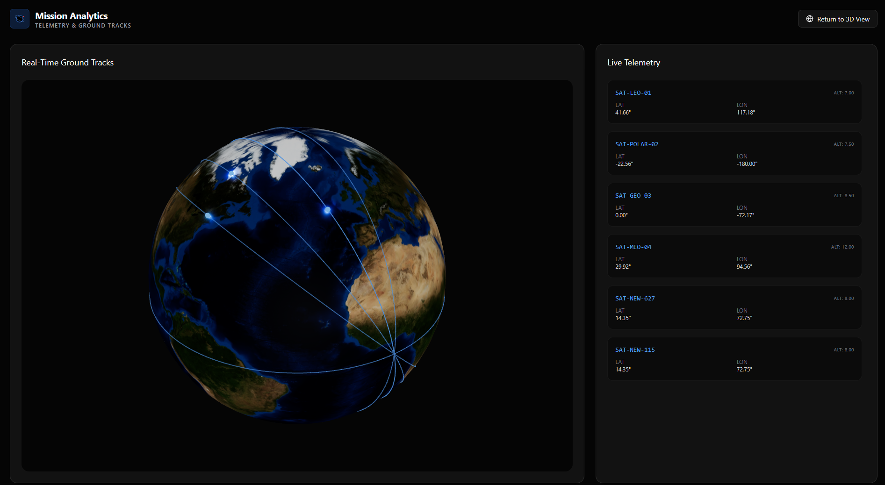

# Orbital Mission Control System (Path Visualizer)



The **Orbital Mission Control System** is a high-performance, cinematic 3D WebGL application designed to simulate, monitor, and analyze satellite orbital trajectories in real-time. 

Built with modern web technologies, the application transitions from standard 2D data plotting to an immersive, interactive 3D spatial environment. It provides real-time collision detection, automated evasive maneuvers, and high-fidelity ground track telemetry.

---

## Key Features

### 1. Cinematic 3D WebGL Environment
- **Dark Mode Earth Visualization:** The main dashboard renders the Earth using a sleek, glowing blue wireframe layered over a dark sphere, emphasizing clarity and modern aesthetics.
- **Dynamic Satellite Rendering:** Payloads are represented as 3D geometries that cast dynamic lights and trail glowing orbital paths as they traverse the globe.
- **60 FPS Performance:** Fully optimized rendering loop powered by Three.js and React Three Fiber, allowing smooth camera panning, zooming, and automated rotation.

### 2. Real-Time Collision Simulator

- **Spatial Intersection Detection:** A custom physics engine continuously measures the Euclidean distance between all active payloads in 3D space.
- **Critical Alert System:** If two satellites breach the minimum safe distance threshold, a persistent, pulsing red warning panel overlays the UI, pinpointing the exact coordinates of the incident.
- **Visual Impact Indicators:** The exact location of a potential collision is dynamically highlighted directly on the 3D globe with a pulsing red energy sphere and a localized point light.
- **Automated Evasive Maneuvers:** Operators can click the **"Evade"** button on an alert to algorithmically alter a satellite's orbital phase and boost its altitude, safely separating the trajectories.
- **Deorbit Capabilities:** Operators can choose to permanently remove compromised payloads from the constellation using the **"Deorbit"** function.

### 3. Mission Analytics & Ground Tracks

- **Textured Daylight Globe:** The `/analytics` route swaps the abstract wireframe for a high-resolution, photorealistic daytime Earth map (`blue-marble`), providing geographical context.
- **Surface Projections:** Instead of floating in space, the orbital paths are mathematically projected directly onto the surface of the Earth as ground tracks.
- **Live Telemetry Stream:** A dedicated data panel streams real-time altitude, latitude, and longitude metrics for every active satellite.
- **Global State Synchronization:** Utilizing `Zustand`, the exact spatial coordinates, time scale, and satellite payloads persist seamlessly as you navigate between the Main Mission Control and Analytics dashboards.

### 4. "Componentry-Style" Glassmorphic UI
- **Premium Aesthetics:** The interface abandons standard rigid dashboards in favor of floating, frosted glass components (`backdrop-blur`).
- **Interactive Payload Injection:** Operators can manually launch new satellites into orbit by specifying parameters like Designation, Altitude, Velocity, and Inclination directly from the UI.
- **Time Dilation Controls:** A time multiplier slider allows operators to speed up orbital mechanics to preview future trajectories and predict collisions.

---

## Architecture & Tech Stack

This project was built to leverage the fastest and most modern tools in the React ecosystem:

- **Core Framework:** [Next.js 16](https://nextjs.org/) (App Router & Turbopack)
- **3D Graphics Engine:** [Three.js](https://threejs.org/)
- **React 3D Integration:** [React Three Fiber](https://docs.pmnd.rs/react-three-fiber) & [@react-three/drei](https://github.com/pmndrs/drei)
- **Global State Management:** [Zustand](https://github.com/pmndrs/zustand)
- **Styling & UI:** [Tailwind CSS 4](https://tailwindcss.com/)
- **Icons:** [Lucide React](https://lucide.dev/)

---

## Orbital Physics Engine

The core math driving the visualization lives in `src/utils/physics.ts`. Rather than relying on external APIs, the application uses trigonometric calculations to dynamically position payloads in 3D space.

A satellite's position at time `t` is calculated using:
- **`r` (Altitude/Radius):** Distance from the Earth's core.
- **`w` (Velocity/Angular Frequency):** How fast the payload revolves around the Earth.
- **`inc` (Inclination):** The tilt of the orbit relative to the equator.
- **`phase` (Orbital Phase):** The satellite's current position along its trajectory ring.

```typescript
export function getSatellitePosition(r: number, w: number, t: number, inc: number, phase: number) {
  // Base orbital plane calculation
  const theta = w * t + phase;
  const x0 = r * Math.cos(theta);
  const z0 = r * Math.sin(theta);
  
  // Inclination rotation matrix applied to the Z-axis
  const incRad = (inc * Math.PI) / 180;
  const y = z0 * Math.sin(incRad);
  const z = z0 * Math.cos(incRad);
  
  return [x0, y, z];
}
```

---

## Installation & Local Deployment

1. **Clone the repository and ensure you have Node.js (v18+) installed.**
2. **Navigate to the root directory** (where the Next.js `package.json` is located).
3. **Install all dependencies:**
   ```bash
   npm install
   ```
4. **Boot the Next.js development server (using Turbopack):**
   ```bash
   npm run dev
   ```
5. **Launch Mission Control:**
   Open your browser and navigate to [http://localhost:3000](http://localhost:3000) to view the live dashboard.

---

## Project Structure

```text
PATH-VISUALIZER/
├── src/
│   ├── app/
│   │   ├── analytics/     # Mission Analytics Page & Ground Tracks
│   │   ├── globals.css    # Global Tailwind styles & CSS variables
│   │   ├── icon.svg       # Vector Mission Control Favicon
│   │   ├── layout.tsx     # Next.js Root Layout
│   │   └── page.tsx       # Main Mission Control & Collision Simulator
│   ├── components/
│   │   ├── AnalyticsGlobe.tsx # Textured Earth & Surface Projections
│   │   └── GlobeScene.tsx     # Dark Mode Wireframe Earth & 3D Canvas
│   ├── utils/
│   │   └── physics.ts     # Orbital math, collision detection, and evasive logic
│   └── store.ts           # Zustand global state (Constellation & App State)
├── package.json
└── Readme.md              # You are here!
```

---
*Developed for advanced spatial trajectory visualization.*
